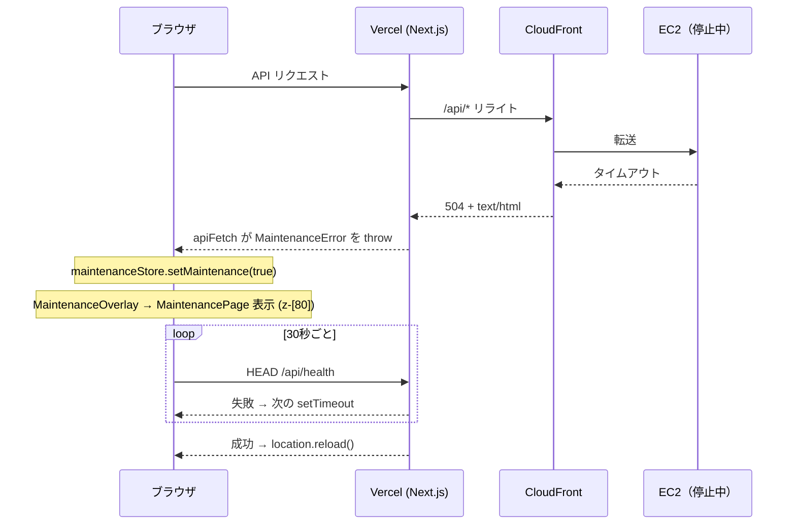

# アーキテクチャ

> 関連ドキュメント: [ビルドフロー](build-flow.md) | [機能モジュール](modules.md)

## ディレクトリ構造

```
src/
├── app/                        # App Router ページ・レイアウト
│   ├── (app)/                  # アプリケーション用レイアウトグループ
│   │   ├── add/                # 料理追加ページ
│   │   ├── calendar/           # カレンダーページ
│   │   └── dishes/             # 料理一覧ページ
│   ├── (auth)/                 # 認証用レイアウトグループ
│   │   ├── login/              # ログインページ
│   │   └── register/           # 新規登録ページ
│   ├── MaintenanceOverlay.tsx  # メンテナンスオーバーレイ（Client Component 境界）
│   └── data/                   # データ定義・モック（非推奨）
├── components/                 # UI コンポーネント
│   ├── features/               # 機能別コンポーネント
│   │   ├── auth/               # 認証機能
│   │   ├── calendar/           # カレンダー機能
│   │   └── dishes/             # 料理機能
│   ├── layout/                 # レイアウトコンポーネント
│   └── ui/                     # 汎用 UI コンポーネント（MaintenancePage 含む）
├── lib/                        # ライブラリ・ユーティリティ
│   ├── api/                    # API 通信
│   ├── hooks/                  # カスタムフック
│   └── utils/                  # ユーティリティ関数
├── stores/                     # 状態管理（Zustand）
└── types/                      # TypeScript 型定義
```

## 概要

### ページ構成

App Routerのルートグループ機能を使用し、認証状態によってレイアウトを分離:

- `(app)` - 認証済みユーザー向けレイアウト（ヘッダー、ナビゲーション付き）
- `(auth)` - 認証ページ向けレイアウト（シンプルなレイアウト）

### コンポーネント設計

3層構造で整理:

1. **features/** - 特定機能に紐づくコンポーネント
2. **layout/** - ページ全体の構造を定義するコンポーネント
3. **ui/** - 再利用可能な汎用コンポーネント

### 状態管理

Zustandを使用したシンプルな状態管理:

- `authStore.ts` - 認証状態（ユーザー情報、ログイン状態）
- `maintenanceStore.ts` - メンテナンス状態（`isMaintenance`）

### メンテナンス検知フロー

EC2 停止時に CloudFront が返す 504 + `text/html` を `apiFetch` が検知し、グローバルにメンテナンス画面を表示する。

以前は CloudFront カスタムエラーレスポンスで S3 配置の `maintenance.html` を返していたが、以下の理由で廃止し Next.js に統一した:

- S3 + CloudFront への別途デプロイという運用コストが発生していた
- Next.js 側で検知・表示することでデプロイ手順を簡素化できる
- デザインを React コンポーネントで一元管理できる


