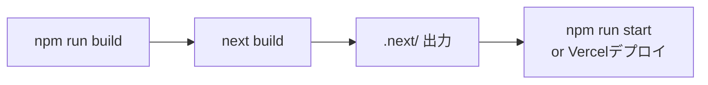
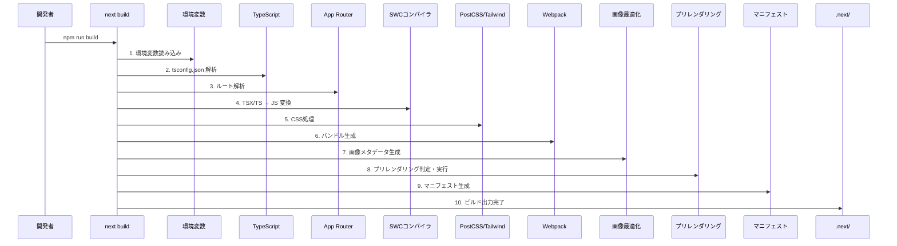
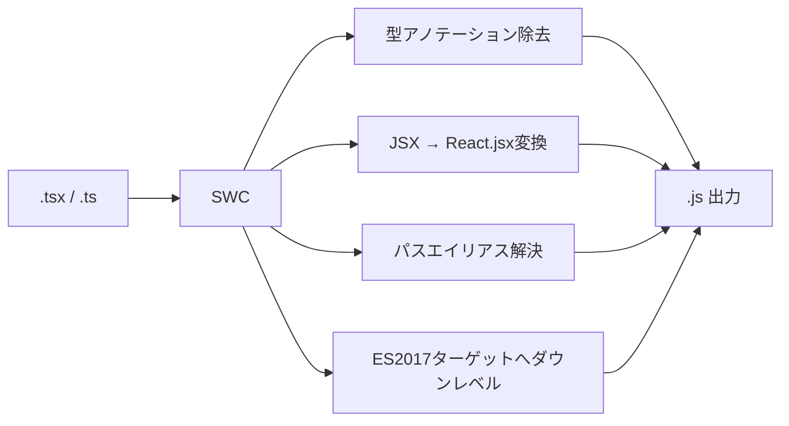
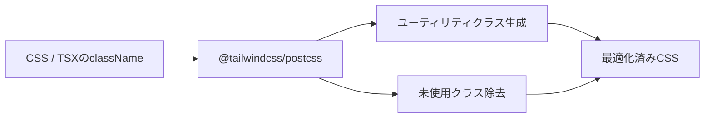
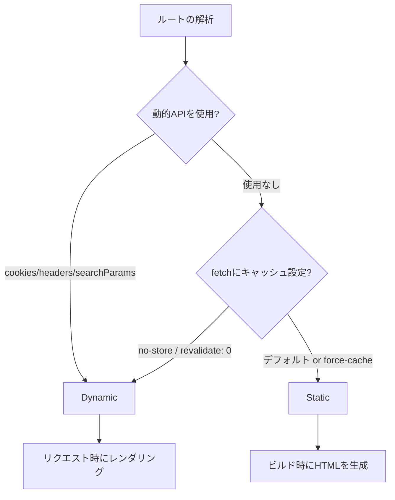
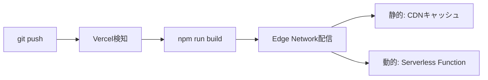

# ビルドフロー

`npm run build`（`next build`）実行時の処理フローを解説する。

## 目次

- [概要](#概要)
- [フロー全体図](#フロー全体図)
- [1. 環境変数読み込み](#1-環境変数読み込み)
- [2. TypeScript設定解析](#2-typescript設定解析)
- [3. App Routerルート解析](#3-app-routerルート解析)
- [4. SWCコンパイル](#4-swcコンパイル)
- [5. PostCSS + Tailwind v4 CSS処理](#5-postcss--tailwind-v4-css処理)
- [6. Webpackバンドル生成](#6-webpackバンドル生成)
- [7. 画像最適化メタデータ生成](#7-画像最適化メタデータ生成)
- [8. プリレンダリング判定](#8-プリレンダリング判定)
- [9. マニフェストファイル生成](#9-マニフェストファイル生成)
- [10. ビルド出力完了](#10-ビルド出力完了)
- [11. 本番起動 / Vercelデプロイ](#11-本番起動--vercelデプロイ)

## 概要

本プロジェクトは Next.js 16.1.1（App Router）を使用している。`npm run build` は内部で `next build` を実行し、`.next/` ディレクトリにビルド成果物を出力する。



## フロー全体図



## 1. 環境変数読み込み

ビルド開始時に環境変数を読み込み、設定値を決定する。

### 読み込み順序

| 優先度 | ソース | 説明 |
|--------|--------|------|
| 1（最高） | `process.env` | 実行環境の環境変数（CI/CD、Vercel設定） |
| 2 | `.env.$(NODE_ENV).local` | 環境別ローカル上書き（例: `.env.production.local`） |
| 3 | `.env.local` | ローカル上書き（`NODE_ENV=test` 時はスキップ） |
| 4 | `.env.$(NODE_ENV)` | 環境別デフォルト（例: `.env.production`） |
| 5（最低） | `.env` | 全環境共通デフォルト |

> **補足**: 同一変数が複数ファイルに定義されている場合、優先度の高いソースが**先勝ち**で採用され、後続ファイルの値は無視される。`next build` 実行時は `NODE_ENV=production` が自動設定されるため、`.env.production.local` → `.env.local` → `.env.production` → `.env` の順に読み込まれる。

### 本プロジェクトで使用する環境変数

| 変数名 | スコープ | 用途 |
|--------|---------|------|
| `API_REWRITE_DESTINATION` | サーバーサイド専用 | APIリライト先のベースURL |
| `NEXT_PUBLIC_IMAGE_HOST` | クライアント・サーバー両方 | 画像配信元ホスト名 |

`next.config.ts` でこれらの値を参照し、`images.remotePatterns` と `rewrites` を設定する。

```typescript
// next.config.ts での使用例
const apiRewriteDestination = process.env.API_REWRITE_DESTINATION || 'https://dm1vi7xjicrqg.cloudfront.net';
const imageHost = process.env.NEXT_PUBLIC_IMAGE_HOST || 'dm1vi7xjicrqg.cloudfront.net';
```

> **注意**: `NEXT_PUBLIC_` プレフィックス付きの変数はビルド時にクライアントバンドルへインライン展開される。ビルド後の変更は反映されない。

## 2. TypeScript設定解析

`tsconfig.json` を解析し、コンパイルオプションを決定する。

### 主要設定

| 設定 | 値 | 説明 |
|------|-----|------|
| `target` | `ES2017` | 出力先のECMAScriptバージョン |
| `module` | `esnext` | ESModules形式で出力 |
| `moduleResolution` | `bundler` | バンドラー向けのモジュール解決 |
| `jsx` | `react-jsx` | React 17+のJSX Transform使用 |
| `strict` | `true` | 厳格な型チェック有効 |
| `noEmit` | `true` | tscは型チェックのみ（変換はSWCが担当） |
| `incremental` | `true` | インクリメンタルビルド有効 |

### パスエイリアス

```json
{
  "paths": {
    "@/*": ["./src/*"]
  }
}
```

`@/components/ui/Button` のようなインポートが `./src/components/ui/Button` に解決される。

### Next.jsプラグイン

`tsconfig.json` の `plugins` に `"next"` を指定することで、App Router固有の型（`page.tsx` や `layout.tsx` のprops型など）が自動生成される。型定義は `.next/types/` に出力される。

## 3. App Routerルート解析

`src/app/` ディレクトリを走査し、ファイルシステムベースのルーティングテーブルを構築する。

### 本プロジェクトのルート構造

```
src/app/
├── layout.tsx              → ルートレイアウト
├── page.tsx                → /
├── (app)/                  → 認証済みユーザー用グループ
│   ├── layout.tsx          → 共通レイアウト（ヘッダー、ナビゲーション）
│   ├── add/page.tsx        → /add
│   ├── calendar/page.tsx   → /calendar
│   └── dishes/page.tsx     → /dishes
└── (auth)/                 → 認証ページ用グループ
    ├── layout.tsx          → 認証レイアウト
    ├── login/page.tsx      → /login
    └── register/page.tsx   → /register
```

### 認識されるファイル規約

| ファイル名 | 役割 |
|-----------|------|
| `page.tsx` | ルートのUIコンポーネント |
| `layout.tsx` | 共有レイアウト（子ルート間で状態保持） |
| `loading.tsx` | ローディングUI（Suspense境界） |
| `error.tsx` | エラーバウンダリ |
| `not-found.tsx` | 404ページ |

### ルートグループ `()`

`(app)` や `(auth)` はルートグループとして扱われ、URLパスには含まれない。レイアウトの分離のみを目的とする。

## 4. SWCコンパイル

Next.jsはRust製のSWCコンパイラを使用し、TypeScript/JSXをJavaScriptに変換する。Babelと比較して大幅に高速。

### 処理内容



- **型アノテーション除去**: TypeScriptの型情報を削除（型チェック自体はステップ2で完了）
- **JSX変換**: `react-jsx` ランタイムを使用（`import React` 不要）
- **パスエイリアス**: `@/*` → `./src/*` への変換
- **ダウンレベル**: `ES2017` ターゲットに合わせた構文変換

## 5. PostCSS + Tailwind v4 CSS処理

本プロジェクトはTailwind CSS v4を使用し、`@tailwindcss/postcss` プラグインで処理する。

### 処理パイプライン



### PostCSS設定

```javascript
// postcss.config.mjs
const config = {
  plugins: {
    "@tailwindcss/postcss": {},
  },
};
```

### Tailwind v4の特徴

Tailwind v4ではCSSファイルに `@import "tailwindcss"` を記述するだけで設定が完了する。従来の `tailwind.config.js` は不要。

- **自動コンテンツ検出**: プロジェクト内の全ファイルからクラス名を自動スキャン
- **ビルド時最適化**: 実際に使用されているユーティリティクラスのみをCSSに含める
- **CSS変数ベース**: テーマ値がCSS Custom Propertiesとして出力される

## 6. Webpackバンドル生成

SWCで変換されたJavaScriptとCSSをWebpackがバンドルする。

### 出力バンドル

| バンドル種別 | 内容 | 出力先 |
|-------------|------|--------|
| Server Components | RSC（React Server Components）ペイロード | `.next/server/` |
| Client Components | `"use client"` 宣言のあるコンポーネント | `.next/static/chunks/` |
| Framework | React, Next.jsランタイム | `.next/static/chunks/` |
| Commons | 複数ページで共有されるコード | `.next/static/chunks/` |

### コード分割

- **ページ単位分割**: 各ルートが独立したチャンクになる
- **動的インポート**: `next/dynamic` や `React.lazy` によるオンデマンドロード
- **共通コード抽出**: 複数チャンクで使用されるモジュールは `commons` チャンクに分離

### Tree Shaking

未使用のエクスポートはバンドルから除外される。ESModulesの静的構造を利用して不要コードを検出・削除する。

## 7. 画像最適化メタデータ生成

`next.config.ts` の `images` 設定に基づき、画像最適化のためのメタデータを生成する。

### 本プロジェクトの画像設定

```typescript
images: {
  remotePatterns: [
    {
      protocol: isLocalHost ? 'http' : 'https',
      hostname: imageHost,  // 環境変数で切替
      pathname: '/**',
    },
    {
      protocol: 'https',
      hostname: 'dm1vi7xjicrqg.cloudfront.net',
      pathname: '/**',
    },
  ],
},
```

### ビルド時の処理

- **許可パターン登録**: `remotePatterns` をマニフェストに記録し、ランタイムで許可判定に使用
- **静的画像のインポート**: `import` された画像ファイルは幅・高さ・blurDataURLが自動算出される
- **画像最適化自体はランタイム処理**: ビルド時は設定の検証とメタデータ生成のみ

## 8. プリレンダリング判定

各ルートを **Static**（静的生成）と **Dynamic**（動的レンダリング）に分類する。

### 判定フロー



### ビルド出力の表記

ビルド完了時に各ルートのレンダリング方式が表示される:

| 記号 | 意味 |
|------|------|
| `○` (Static) | ビルド時にHTMLとして静的生成 |
| `λ` (Dynamic) | リクエスト時にサーバーサイドレンダリング |
| `◐` (Partial Prerender) | 静的シェル + 動的ストリーミング |

## 9. マニフェストファイル生成

ビルド成果物のメタデータを JSON ファイルとして `.next/` に出力する。

### 主要マニフェスト

| ファイル | 内容 |
|---------|------|
| `build-manifest.json` | ページごとのJSチャンクマッピング |
| `react-loadable-manifest.json` | 動的インポートのチャンクマッピング |
| `routes-manifest.json` | ルーティングテーブル・リライトルール |
| `prerender-manifest.json` | 静的生成ページの一覧とrevalidate設定 |
| `server-reference-manifest.json` | Server Actions のマッピング |

### リライトルールの反映

`next.config.ts` の `rewrites()` で定義したルールが `routes-manifest.json` に記録される:

```json
{
  "source": "/api/:path*",
  "destination": "https://dm1vi7xjicrqg.cloudfront.net/api/:path*"
}
```

## 10. ビルド出力完了

全ステップが完了すると `.next/` ディレクトリにビルド成果物が出力される。

### 出力ディレクトリ構造

```
.next/
├── server/           # サーバーサイド成果物
│   ├── app/          # App Routerのサーバーコンポーネント
│   ├── chunks/       # サーバーサイドのコードチャンク
│   └── pages/        # Pages Router互換（_document, _appなど）
├── static/           # クライアントサイド静的ファイル
│   ├── chunks/       # JavaScriptチャンク
│   ├── css/          # 最適化済みCSS
│   └── media/        # 静的アセット
├── types/            # Next.jsが自動生成する型定義
├── build-manifest.json
├── routes-manifest.json
└── prerender-manifest.json
```

### ビルドログの確認ポイント

```
Route (app)                    Size     First Load JS
┌ ○ /                          ...      ...
├ ○ /add                       ...      ...
├ ○ /calendar                  ...      ...
├ ○ /dishes                    ...      ...
├ ○ /login                     ...      ...
└ ○ /register                  ...      ...

○  (Static)   prerendered as static content
λ  (Dynamic)  server-rendered on demand
```

- **Size**: そのルート固有のJSサイズ
- **First Load JS**: 初回アクセス時にロードされるJS合計（共通 + 固有）

## 11. 本番起動 / Vercelデプロイ

### ローカル本番起動

```bash
npm run start  # next start
```

Node.jsサーバーがポート3000で起動し、`.next/` の成果物を配信する。

### Vercelデプロイ

本プロジェクトはVercelにデプロイする。



#### Vercelでのビルドフロー

1. **リポジトリ検知**: `git push` をトリガーにビルド開始
2. **依存関係インストール**: `npm install` を自動実行
3. **ビルド実行**: `npm run build`（`next build`）
4. **成果物デプロイ**:
   - 静的ページ → Edge Network（CDN）にキャッシュ
   - 動的ページ → Serverless Functionとしてデプロイ
   - API Rewrites → `routes-manifest.json` に基づきルーティング設定

#### 環境変数の管理

Vercelダッシュボードで環境変数を設定する。`next.config.ts` で参照する `API_REWRITE_DESTINATION` や `NEXT_PUBLIC_IMAGE_HOST` はVercel側で管理する。
